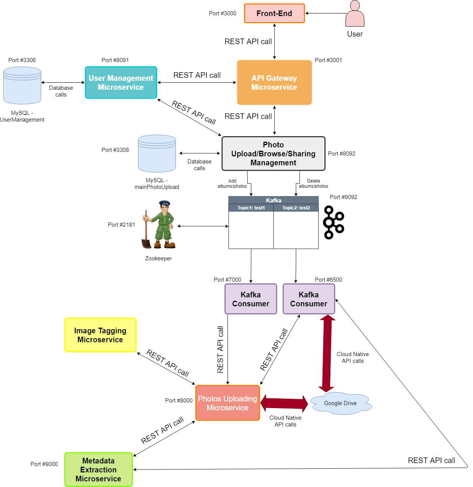

# PingIntelligence

## Project Overview

This project provides a user interface to upload photos to the archive on remote storage servers. It provides pipelines for extracting additional picture metadata using open-source image parsing libraries. The application also enables browsing the photos organized into collections and metadata searches. It makes use of distributed systems architecture along with Micro-services & Micro-Frontends, and Cloud-Native Architecture principles. The end system developed in three incremental milestones should be highly available and highly scalable, and the architecture should be demonstrably evolvable over time. This project is proposed to use Security (Custos Website, Custos Paper) and Data Management components from the Apache Airavata ecosystem and support accessible storage systems such as https://kb.iu.edu/d/aczn#research , https://uits.iu.edu/google , and https://uits.iu.edu/onedrive using Apache Airavata Managed File Transfer services ( MFT Paper ).

## Napkin Diagram

## Architecture Diagram

## Team Introduction

- [Sudip Padhye](https://www.linkedin.com/in/sudippadhye/)
- [Meet Valia](https://www.linkedin.com/in/meet-valia)
- [Srikanth Velpuri](https://in.linkedin.com/in/srikanth-velpuri-706314100)