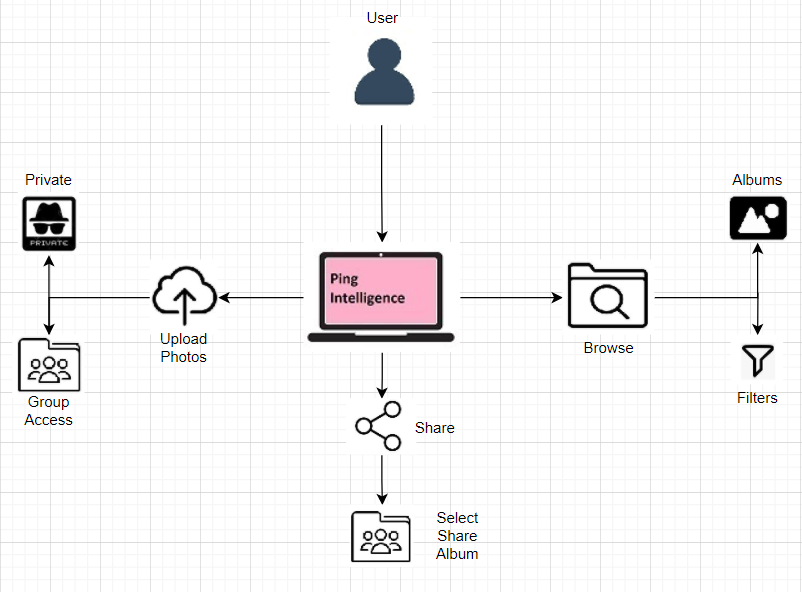
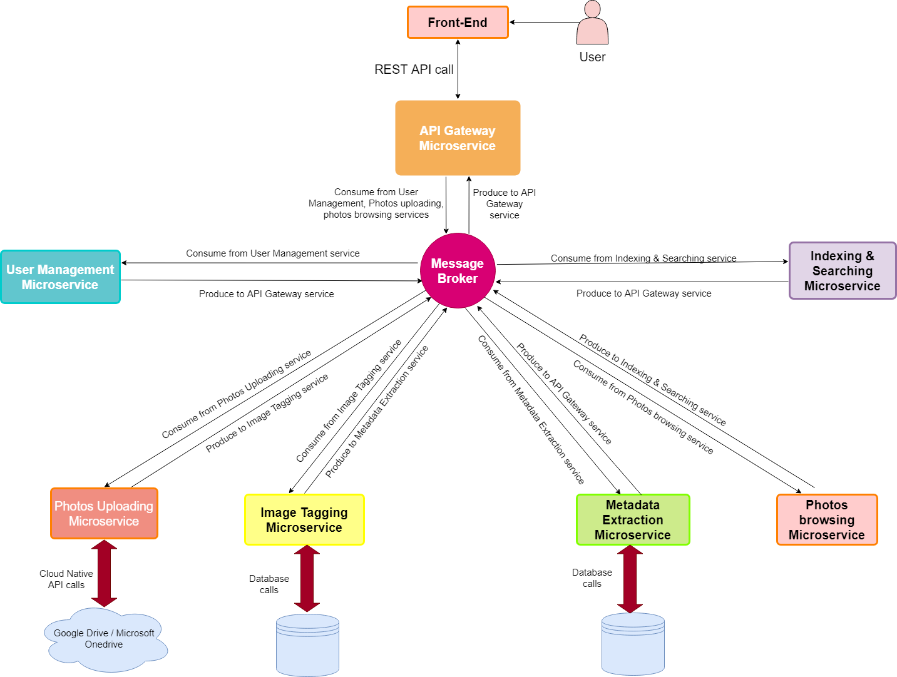

  

## Project Overview

 This project provides a user interface to upload photos to the archive on remote storage servers. It provides pipelines for extracting additional picture metadata using open-source image parsing libraries & Image tags using ML/DL algorithms. The application also enables browsing the photos organized into collections and metadata & tag based searches. It makes use of distributed systems architecture along with Micro-services & Micro-Frontends, and Cloud-Native Architecture principles.
 

<b>Languages Used:</b>
1. Front-End: <i> React.JS </i>
2. Back-End: <i> Java, Python, Node.js </i>

## Napkin Diagram

 Ping Intelligence is a personal photo sharing and backup application which will enable to users and its groups to store memories.
User has the ability to organize their photos into albums.
The user can upload photos and store it in personalized albums. User can also share these albums with other users.
The user can keep albums as private as a personal backup option.
The user has the ability to browse all photos uploaded by him/her and also browse albums shared with the users by other users.
The filter feature enables the user just view images which meet a certain criteria like pictures taken on a specific date or pictures above or below a certain resolution.
 

## Architecture Diagram

## How to use?
> git clone "https://github.com/eayoungs/react-django-login-example.git"

#### Open a Terminal for Front-end

> cd react-django-login\frontend

> npm install

> npm start

#### Open a Terminal for Back-end

> cd react-django-login\backend

> python -m venv backend_env

> backend_env\Scripts\activate.bat

> install django-debug-toolbar

> pip install django-cors-headers

> pip install djangorestframework

> pip install djoser

> pip install django-rest-swagger

> pip install djangorestframework-jwt

> python manage.py makemigrations custom_user

> python manage.py migrate

> python manage.py createsuperuser

> python manage.py runserver

## Team Introduction

- [Sudip Padhye](https://www.linkedin.com/in/sudippadhye/)
- [Meet Valia](https://www.linkedin.com/in/meet-valia)
- [Srikanth Velpuri](https://in.linkedin.com/in/srikanth-velpuri-706314100)
